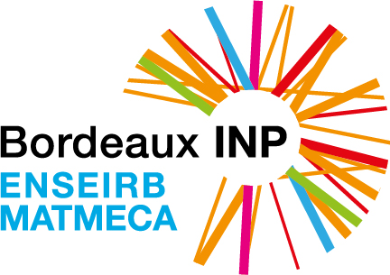
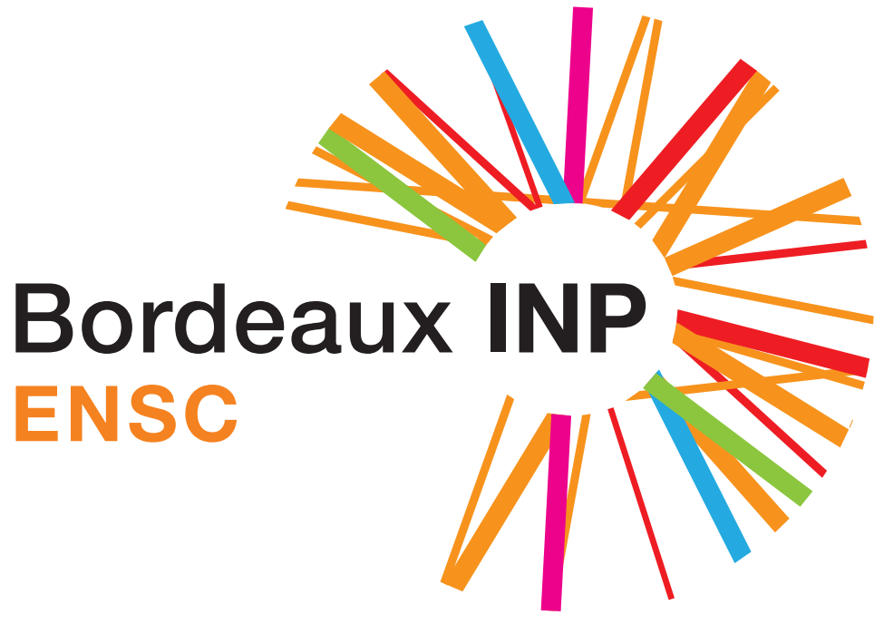

<!-- PROJECT LOGO -->
<br />
<h1 align="center">Video scene classification</h1>

<!-- TABLE OF CONTENTS -->
## Table of Contents

- [Table of Contents](#table-of-contents)
- [About The Project](#about-the-project)
  - [Built With](#built-with)
- [Getting Started](#getting-started)
  - [Installation](#installation)
  - [Training](#training)
  - [Inference](#inference)
- [License](#license)

<!-- ABOUT THE PROJECT -->
## About The Project

This project is part of our Artificial Intelligence courses at ENSEIRB-Matmeca a Bordeaux-INP Graduate High School of engineering. The goal is to use 3d resnet to classify videos.

<p align="center">
  <a href="https://enseirb-matmeca.bordeaux-inp.fr/fr">
    
  </a>

  <a href="https://ensc.bordeaux-inp.fr/fr">
    
  </a>
</p>

We implemented and trained the machine learning architecture ResNet34 using the PyTorch framework.

In order to improve the results of the model we used different techniques:
* GAN data augmentation

### Built With
* [Python](https://www.python.org/)
* [PyTorch](https://www.pytorch.org/)


<!-- GETTING STARTED -->
## Getting Started

In order to install our project, you first need a Python [3.7] and [PyTorch].

### Installation

1. Create a python 3.7 environment, preferably using [Anaconda](https://www.anaconda.com/)
2. Clone the repo
```sh
git clone https://github.com/MohamedSerrari/video_risk_detection.git
```
3. In you anaconda environment install the requirements
```sh
pip install -r requirements.txt
```

<!-- USAGE EXAMPLES -->
### Training

In order to train a specific model run the command:

```sh
python train.py --lr=10-3 --gan-augment --model=resnet34.yaml --weights=resnet34.pt
```

To visualise using tensorboard run in a **different** terminal the command:

```sh
python tensorboard --logdir=runs
```

And open in your browser [localhost:8080](localhost:8080)

### Inference

To get the predictions of the model

```sh
python predict.py --model=resnet34.yaml --weights=resnet34.pt --input=/directory/to/data
```


<!-- LICENSE -->
## License

Distributed under the MIT License. See `LICENSE` for more information.
